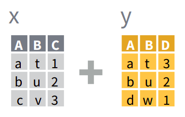

```{r setup, include=FALSE}
knitr::opts_chunk$set(echo = TRUE)
```

Un mismo conjunto de datos puede estar en un formato "ancho" o "largo". Los datos en formato "largo" o "tidy", son aquellos en los cuales:

-   cada fila es una observación
-   cada columna es una variable

En el formato "ancho" es un poco más complejo de definirlo pero la idea general es que:

-   cada fila es un "item"
-   cada columna es una variable


Una tabla en formato largo va a tener una cierta cantidad de columnas que cumplen el rol de identificadores y cuya combinación identifican una única observación y una única columna con el valor de la observación. En el ejemplo de arriba, `pais` y `anio` son las columnas identificadoras y `casos` es la columna que contiene el valor de las observaciones.

En una tabla ancha, cada observación única se identifica a partir de la intersección de filas y columnas. En el ejemplo, los países están en las filas y los años en las columnas.

En general, el formato ancho es más compacto y legible por humanos mientras que el largo es más fácil de manejar con la computadora. Si te fijás en las tablas de arriba, es más fácil comparar los valores entre países y entre años en la tabla ancha. Pero el nombre de las columnas ("1999", "2000") en realidad ¡son datos! Además este formato se empieza a complicar en cuanto hay más de dos identificadores.

Un mismo set de datos puede ser representado de forma completamente "larga", completamente "ancha" o --lo que es más común-- en un formato intermedio pero no existe una forma "correcta" de organizar los datos; cada una tiene sus ventajas y desventajas. Por esto es que es muy normal que durante un análisis los datos vayan y vuelvan entre distintos formatos dependiendo de los métodos estadísticos que se le aplican. Entonces, aprender a transformar datos anchos en largos y viceversa es un habilidad muy útil.

::: {.alert .alert-info}
**Desafío**

En las tablas de ejemplo cada país tiene el un valor observado de "casos" para cada año. ¿Cómo agregarías una nueva variable con información sobre "precios"? Dibujá un esquema en papel y lápiz en formato ancho y uno en formato largo. ¿En qué formato es más "natural" esa extensión?
:::

En esta sección vas a usar el paquete {tidyr} para manipular datos. Si no lo tenés instalado, instalalo con el comando:

```{r eval = FALSE}
install.packages("tidyr")
```

Y luego cargá {tidyr} y {dplyr} (que usaste en [una sección anterior](05-dplyr.html)) con:

```{r}
library(tidyr)
library(dplyr)
```

## De ancho a largo con `pivot_longer()`

En secciones anteriores usaste datos de una estación meteorológica en Bariloche:

```{r}
bariloche <- readr::read_csv("datos/bariloche_enlimpio.csv")
bariloche
```

::: {.alert .alert-success}
¿Notaste que en el código anterior no usaste `library(readr)` para cargar el paquete y luego leer? Con la notación `paquete::funcion()` podés acceder a las funciones de un paquete sin tener que cargarlo. Es una buena forma de no tener que cargar un montón de paquetes innecesarios si vas a correr una única función de un paquete pocas veces.
:::

¿Cómo harías para calcular el valor medio mensual de cada variable relacionada con la temperatura? En el formato en el que están ahora los datos, tendrías que hacer algo como esto

```{r}
bariloche %>% 
  group_by(mes) %>% 
  summarise(Temperatura_abrigo_150cm = mean(Temperatura_Abrigo_150cm, na.rm = TRUE),
            Temperatura_Abrigo_150cm_Maxima = mean(Temperatura_Abrigo_150cm_Maxima, na.rm = TRUE), 
            Temperatura_Abrigo_150cm_Minima = mean(Temperatura_Abrigo_150cm_Minima, na.rm = TRUE))
```

::: {.alert .alert-info}
**Desafío**

Extendé el código de arriba para calcular el promedio de todas las 30 variables incluidas en la tabla `bariloche`.

¡No! Sería un ejercicio altamente tedioso.
:::

Para no tener que escribir 30 líneas todas iguales, sería mejor poder hacer un promedio para cada mes **y para cada variable**. Algo como esto:

```{r, eval = FALSE}
bariloche %>% 
  group_by(mes, variable) %>% 
  summarise(promedio = mean(valor, na.rm = TRUE))
```

Para poder hacer eso hay que tener los datos en un formato más largo. Para convertirlo en una tabla más larga, se usa `pivot_longer()` ("longer" es "más largo" en inglés):

```{r}
bariloche_largo <- bariloche %>% 
  select(Fecha, starts_with("Temperatura")) %>% 
  pivot_longer(cols = -Fecha,
               names_to = "variable_lugar_altura_tipo",
               values_to = "valor")

bariloche_largo
```

Lo primero que hace este código es seleccionar sólo las columnas de interés: la Fecha y las columnas de temperatura. Para no tener que escribir los nombres enteros de las columnas de temperatura (¡que son muy largos!) usa la función `starts_with()` que, como su nombre (en inglés) lo indica, selecciona todas las columnas que empiezan con "Temperatura".

::: {.alert .alert-success}
Existen otras funciones accesorias para seleccionar muchas funciones encapsuladas en el paquete "tidyselect". Si querés leer más detalles de las distintas formas que podés seleccionar variables leé la documentación usando `?tidyselect::language`.
:::

Luego, el código usa `pivot_longer()` para "alargar" la tabla es la tabla que va a modificar: `bariloche`. El segundo argumento se llama `cols` y es un vector con las columnas que tienen los valores a "alargar". Podría ser un vector escrito a mano (algo como `c("Temperatura_Abrigo_150cm", "Temperatura_Abrigo_150cm_Maxima"...)`) pero con más de 30 columnas, escribir todo eso sería tedioso y probablemente estaría lleno de errores. El código de arriba usa la sintaxis de "-columna" para indicar que son todas las columnas menos la columnas "Fecha".

El tercer y cuarto argumento son los nombres de las columnas de "nombre" y de "valor" que va a tener la nueva tabla. Como la nueva columna de identificación tiene los datos de la variable, el lugar donde se mide, la altura y el tipo de variable (mínima, máxima) , "variable\_lugar\_altura\_tipo" es un buen nombre. Y la columna de valor va a tener... bueno, el valor.

Tomate un momento para visualizar lo que acaba de pasar. La tabla ancha tenía un montón de columnas con distintos datos. Ahora estos datos están uno arriba de otro en la columna "valor", pero para identificar el nombre de la columna de la cual vinieron, se agrega la columna "variable".


La columna `variable_lugar_altura_tipo` todavía no es muy útil porque contiene 4 datos, la variable (temperatura), el lugar, la altura y el tipo de observación. Sería mejor separar esta información en dos columnas llamadas "variable", "lugar", "altura" y "tipo". Para eso está la función `separate()`.

```{r}
bariloche_largo <- separate(bariloche_largo, 
                            col = variable_lugar_altura_tipo, 
                            into = c("variable", "lugar", "altura", "tipo"), 
                            sep = "_")
bariloche_largo
```

El primer argumento, como siempre, es la tabla a procesar. El segundo, `col`, es la columna a separar en dos (o más) columnas nuevas. El tercero, `into` es el nombre de las nuevas columnas que `separate()` va a crear. El último argumento es `sep` que define cómo realizar la separación. Por defecto, `sep` es una [expresión regular](https://es.wikipedia.org/wiki/Expresi%C3%B3n_regular) que captura cualquier caracter no alfanumérico.

Habrás notado un problema. Para "Temperatura\_Abrigo\_150cm" y para "Temperatura\_Inte\_5cm", la columna "tipo" es NA. Esto es porque el texto no tiene 4 "pedazos". Sería conveniente agregarle algo. Asumiendo que es una temperatura media, se puede modificar con un `if_else()`:

```{r}
bariloche_largo <- bariloche_largo %>%
  mutate(tipo = if_else(is.na(tipo), "Media", tipo))
bariloche_largo
```

::: {.alert .alert-info}
**Desafío**

Juntá todos los pasos anteriores en una sola cadena de operaciones usando `%>%`.
:::

::: {.alert .alert-info} 
**Desafío** 

Esta tabla sólo tiene datos de temperatura. ¿Se podría incluir cualquier otra variable? ¿Humedad, dirección del viento, estado del tiempo? ¿Cómo lo harías?
:::

## De largo a ancho con `pivot_wider()`

Ahora la variable `bariloche_largo` está en el formato más largo posible. Tiene 6 columnas, de las cuales sólo una es la columnas con valores. Pero con los datos así no podrías hacer un gráfico de puntos que muestre, por ejemplo, la relación entre la tempertura mínima y la tempoeratura máxima. En este caso todos los valores en la columna `valor` tienen las mismas unidades, pero podría tener otras variables, como humedad o presión. En ese caso, no tendrían las mismas unidaes, por lo que operar con ese vector podría dar resultados sin sentido. Muchas veces es conveniente y natural tener los datos en un formato intermedio en donde hay múltiples columnas con los valores de distintas variables observadas.

Pasa "ensanchar" una tabla está la función `pivot_wider()` ("wider" es "más ancha" en inglés) y el código para conseguir este formato intermedio es:

```{r}
bariloche_medio <- pivot_wider(bariloche_largo, names_from = tipo, values_from = valor)
bariloche_medio
```

Nuevamente el primer argumento es la tabla original. El segundo, `names_from` es la columna cuyos valores únicos van a convertirse en nuevas columnas. La columna `tipo` tiene los valores `"Media"`, `"Maxima"` y `"Minima"` y entonces la tabla nueva tendrá tres columnas con esos nombres. El tercer argumento, `values_from`, es la columna de la cual sacar los valores.

Para volver al formato más ancho, basta con agregar más columnas en el argumento `names_from`:

```{r}
pivot_wider(bariloche_largo, 
            names_from = c(variable, lugar, altura, tipo), 
            names_sep = "_",
            values_from = valor)
```

En esta llamada también está el argumento `names_sep`, que determina el caracter que se usa para crear el nombre de las nuevas columnas.

::: {.alert .alert-info}
**Desafío**

- Creá una nueva tabla, llamada `bariloche_superduper_ancho` que sea la tabla más ancha posible que podés generar con estos datos. ¿Cómo es la tabla más ancha posible que podés generar con estos datos? ¿Cuántas filas y columnas tiene?

:::

## Uniendo tablas


Hasta ahora todo lo que usaste de {dplyr} involucra trabajar y modificar con una sola tabla a la vez, pero es muy común tener dos o más tablas con datos relacionados. En ese caso, tenemos que unir estas tablas. a partir de una o más variables en común o keys. En Excel u otro programa de hojas de cálculo, esto se resuelve con la función "VLOOKUP" o "BUSCARV", en R y en particular dentro del mundo de {dplyr} hay que usar la familia de funciones `*_join()`. Hay una función cada tipo de unión que queramos hacer.

Asumiendo que querés unir dos data.frames o tablas `x` e `y` que tienen en común una variable `A`:



-   `full_join()`: devuelve todas las filas y todas las columnas de ambas tablas `x` e `y`. Cuando no coinciden los elementos en `x1`, devuelve `NA` (dato faltante). Esto significa que no se pierden filas de ninguna de las dos tablas aún cuando no hay coincidencia. Está es la manera más segura de unir tablas.

-   `left_join()`: devuelve todas las filas de `x` y todas las columnas de `x` e `y`. Las filas en `x` que no tengan coincidencia con `y` tendrán `NA` en las nuevas columnas. Si hay múltiples coincidencias entre `x`e `y`, devuelve todas las coincidencias posibles.

-   `right_join()`: es igual que `left_join()` pero intercambiando el orden de `x` e `y`. En otras palabras, `right_join(x, y)` es idéntico a `left_join(y, x)`.

-   `inner_join()`: devuelve todas las filas de `x` donde hay coincidencias con `y` y todas las columnas de `x` e `y`. Si hay múltiples coincidencias entre `x` e `y`, entonces devuelve todas las coincidencias. Esto significa que eliminará las filas (observaciones) que no coincidan en ambas tablas, lo que puede ser peligroso.


En el archivo "estaciones_smn.csv" hay metadatos de las estaciones meteorológicas del Servicio Meteorológico Nacional (nombre, provincia, ubicación, etc...):

```{r, message=FALSE}
estaciones <- readr::read_csv("datos/estaciones_smn.csv") 
estaciones
```

Por otra parte, en el archivo "observaciones_smn.csv" hay datos diarios de temperatura mínima y máxima observados en cada una cada una y distintas fechas:

```{r}
observaciones <- readr::read_csv("datos/observaciones_smn.csv")
observaciones
```

Sería muy útil unir ambas tablas de manera de tener la información de la temperatura en cada ubicación. 

Para unir las dos tablas, cualquier función join requiere cierta información:

-   las tablas a unir: son los dos primeros argumentos.
-   qué variable o variables (se puede usar más de una!) usar para identificar coincidencias: el argumento `by`.

Unamos `observaciones` y `estaciones` primero con `full_join()`:

```{r}
estaciones_obs <- full_join(observaciones, estaciones, by = c("station" = "nombre"))
estaciones_obs
```

Como el nombre de la estación en la tabla `observaciones` está en una columna llamada "station", mientras que en la tabla `estaciones`, está en una columna llamada "nombre". Cuando pasa eso, en el argumento `by` hay que poner un vector con nombres.

Si mirás de cerca la tabla unida vas a ver un par de cosas:

-   Todas las columnas de `observaciones` y de `estaciones` están presentes.
-   Todas las observaciones están presentes, aún los estaciones que están presentes en `estaciones` pero no en `observaciones` y viceversa. 

¿Existe alguna estación que no esté en ambas tablas? Si comparás la cantidad de filas de `observaciones` y de `estaciones_obs`, vas a ver que la primera tiene `r nrow(observaciones)` filas y la segunda, `r nrow(estaciones_obs)`. Esto ya da una pista de que probablemente haya una estación en `estaciones` que no está en `observaciones` que es la fila extra.

Para buscar sistemáticamente estas estaciones errantes hay que usar `anti_join`, que devuelve las filas de la tabla de la izquierda que no está en la derecha. Entonces, usando exactamente el mismo código de arriba pero cambiando `full_join` por `anti_join`, queda:

```{r}
anti_join(observaciones, estaciones, by = c("station" = "nombre"))
```

En la tabla `observaciones`, la estación "PRESIDENCIA ROQUE SAENZ PEÑA AERO" existe, tiene un problema de codificación! ¿Qué pasa si intercambás el órden de las variables (y el orden de los nombres en el vector que le pasamos a `by`)?


```{r}
anti_join(estaciones, observaciones, by = c("nombre" = "station"))
```
Esto nos dice que la estación "PRESIDENCIA ROQUE SAENZ PEÑA AERO", está en la tabla `estaciones` con la codificación correcta. `anti_join` es muy útil para encontrar problemas como estos. 

`full_join` es la opción más segura si no sabés si todas las observaciones de una tabla están presente en a otra. Si sólo te interesa conservar las filas de la tabla de la izquierda (en este caso `estaciones` entonces:

```{r}
obs_estaciones <- left_join(observaciones, estaciones,  by = c("station" = "nombre"))
obs_estaciones
```

Esta tabla tiene la misma cantidad de filas que `observaciones`. ¿Qué pasó con la estación que está mal codificada? Filtrando los datos:

```{r}
obs_estaciones %>% 
  filter(startsWith(station, "PRESIDENCIA ROQUE"))
```

`left_join` le puso `NA` en las filas de `observaciones` que no tienen coincidencia con `estaciones`.

Finalmente, si quisieras quedarte sólo con las observaciones que están presentes en ambas tablas usamos `inner_join()`.

```{r}
obs_estaciones <- inner_join(observaciones, estaciones,  by = c("station" = "nombre"))
obs_estaciones
```

En este caso, perdemos las filas de `observaciones` que no encontraron coincidencia en `estaciones` y viceversa.

::: {.alert .alert-info}
**Desafío**

En el archivo "radiacion_smn.csv" hay datos de radiación media diaria medidos en dos estaciones del Servicio Meteorológico Nacional. El objetivo es que unas `observaciones` con esos datos teniendo en cuenta tanto la estación como la fecha.

1.  Lee la base de datos `radiacion_smn.csv` en una nueva variable que se llame `radiacion`.
2.  Revisá el nombre de las variables en esta base de datos, ¿se llaman igual que las variables en `observaciones`?
3. Si te interesa saber la relación entre la temperatura y la radiación medida, ¿qué tipo de join creés que te conviene usar? (Ayuda: ¿Te sirve de algo tener datos de estaciones y fechas donde se midió temperatura pero no radiación o donde se midió radiación pero no temperatura?)
4. Uní las tabla usando la función join que elegiste. Tené en cuenta que ahora usamos dos variables llave `station` y `date`. Buscá en la documentación cómo indicarle eso a la función.
:::

::: {.btn-group role="group" aria-label="Navegación"}
<a href= "05-dplyr.html" class = "btn btn-primary">Anterior</a> 
<a href= "07-graficos-I.html" class = "btn btn-primary">Siguiente</a>
:::


