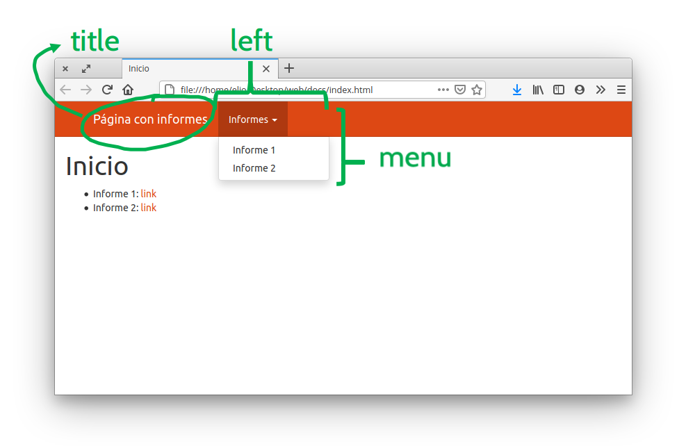

```{r setup, include=FALSE}
knitr::opts_chunk$set(echo = TRUE)
```


De nada sirve amar un informe en R Markdown y luego compilarlo si nadie lo va a ver. Hay que hacérselo llegar a las personas que deben leerlo. Publicar los reportes en una página web puede ser un método especialmente útil para reportes que requieren actualizarse periódicamente y lo bueno es que podés convertir tu reporte de R Markdown en una página web en muy pocos pasos.

## Sitio web de una sola página 

Lo bueno es que si ya sabés cómo generar un reporte en html usando R Markdown, ya sabés todo lo que necesitás para publicar un sitio web simple! Lo único que hace falta es un servicio que te hostee el archivo y lo muestre a los visitantes. Uno de ellos es [Netlify](https://www.netlify.com/), que permite crear un sitio web con sólo arrastrar una carpeta. 

Pero primero un pequeño detalle. Seguramente tu reporte tiene algún nombre descriptivo consistente con su contenido, pero para este paso va a tener que tener el nombre especial: "index.html". Para esto tenés dos opciones: 

1. ponerle "index.Rmd" al archivo de R Markdown y knitear como siempre
2. que tu archivo Rmd tenga el nombre que sea, knitear como siempre y luego ir y renombrar el archivo de salida como "index.html"

En cualquiera de los dos casos, lo que querés tener es una carpeta con un archivo llamado "index.html" adentro. Listo, eso es un sitio web!

Ahora lo último que queda es ir a [https://app.netlify.com/drop](https://app.netlify.com/drop) y arrastrar la carpeta. Netlify va a crear una página web con un nombre aleatorio:


<figure>
<video width=770px controls>
  <source src="img/netlify_drop.webm" type="video/webm">
</video>
</figure>


::: {.alert .alert-info} 
**Desafío** Creá una página web!
1. creá una copia del informe que venís trabajando, renombrala "index.Rmd", *kniteá* y asegurate que el resultado sea un archivo llamado "index.html" en la raiz de la carpeta del proyecto. 
2. Andá a [https://app.netlify.com/drop](https://app.netlify.com/drop)
3. Arrastrá la carpeta de tu proyecto, que tiene el archivo index.html.
:::


:::{.alert .alert-success}
Habrás notado que Netlify borra los sitios web luego de 24 horas. Para que tu sitio sea permanente tenés que crearte una cuenta.
:::

## Sitio web de muchas páginas

Esto que hiciste para un sitio web con una sola página se puede extender para un sitio web con varias páginas simplemente agregando otros archivos html a la carpeta que subís a Netlify. El problema es que por convención, el archivo que vas a poder ver cuando entrás a la URL de tu página siempre va a ser el archivo index.html. Para poder ver los otros tenés agregarlos en la URL, pero esto requiere que sepas el nombre de cada archivo y es muy poco amigable. 

Para un sitio web con más de una página, lo mejor es que el archivo index.html (generado a partir de un archivo llamado "index.Rmd") sea una página "bienvenida" donde estén los vínculos a todos demás archivos. Por ejemplo, un buen archivo index.Rmd podría ser algo como esto:

```markdown
---
title: "Inicio"
---

### Listado de informes:

* Informe 1: [link](informe_1.html)
* Informe 2: [link](informe_2.html)
```

Donde los los archivos informe_1.html e informe_2.html serían generados por sus correspondientes archivos informe_1.Rmd e informe_2.Rmd. Notá que los links son a los archivos html, no a los archivos Rmd!

::: {.alert .alert-info} 
**Desafío** Creá un sitio web con una página de inicio!

1. Creá uno o más archivos Rmd (podés dejar la plantilla por defecto que da RStudio) y knitealos en sus respectivos archivos html. 
2. Abrí el archivo index.Rmd convertila en una página de inicio con vínculos a los archivos html que creaste y knitealo para obtener el archivo index.html
3. Subí esa carpeta a Netlify. 
:::


## Sitio web organizado

Ahora tenés un sitio web funcional pero el flujo de trabajo es muy manual. Tenés que knitear los documentos uno por uno cada vez que los cambiás y en la carpeta de tu proyecto tenés tanto los archivos Rmd como los html, lo cual puede ser molesto. Además, cada página parece aislada: no es posible navegar entre los distintos informes. 

Estos problemas se puede resolver agregando un archivo con el nombre "_site.yml" en la carpeta de tu proyecto. Este archivo va a identificar a este proyecto como un sitio web y va a tener todas las opciones globales del mismo. Además va a servir para generar una barra de navegación que lo va a hacer mucho más amigable. 

Por ejemplo, el archivo _site.yml de este sitio web tiene las siguientes líneas:

```yaml
output_dir: docs

output:
  html_document:
    theme: united

navbar: 
  title: Página con informes
  left: 
  - text: Informes
    menu: 
      - text: Informe 1
        href: informe_1.html
      - text: Informe 2
        href: informe_2.html
```


¿Qué es lo que hace cada parte?

* `output_dir: docs` define que el sitio web se va a generar en la carpeta "docs", que va a estar dentro de la carpeta del proyecto. Esa carpeta va a tener todos los archivos html y demás archivos necesarios para que el sitio funcione.

* `output:...` define opciones globales de salida para no tener que definirlas dentro de cada archivo Rmd. Podés ver las opciones disponibles en la documentación con `?rmarkdown::html_document()`. En este caso, define que la apariencia a a ser con el tema "united". 

* `navbar:...` define una barra de navegación que ves ahí arriba. Tiene varias partes, como un título, un link que lleva a la hoja de ruta, y dos menúes desplegables. 



Tener el archivo _site.yaml tiene otra gran ventaja. Ahora RStudio sabe que querés hacer un sitio web y podés generar todo el sitio web directamente yendo a la solapa "Build" y haciendo click en "Build Website" o con el atajo de teclado Ctrl + Shift + B. Esto va a renderizar todos los archivos .Rmd que estén en la raiz del proyecto y va a generar el sitio web en la carpeta especificada en `output_dir`.

::: {.alert .alert-info}
**Desafío** Armá tu sitio web con barra de navegación!

1. Creá un archivo "_site.yaml".
2. Definí el tema (fijate en la documentación de `rmarkdown::html_document` cuáles son las opciones disponibles)
3. Generá una barra de navegación que linkee a los informes. 
4. Generá el sitio apretando el botón "Build Website" que está en la solapa "Build" de RStudio. 
5. Andá a [https://app.netlify.com/drop](https://app.netlify.com/drop) y arrastrá la carpeta donde se generó el sitio (que va a ser una carpeta dentro del proyecto, no la carpeta del proyecto).
:::


<div class="btn-group" role="group" aria-label="Navegación">
  <a href= "11-reportes-II.html" class = "btn btn-primary">Anterior</a>
  <a href= "hoja-de-ruta.html" class = "btn btn-primary">Hoja de Ruta</a>
</div>

